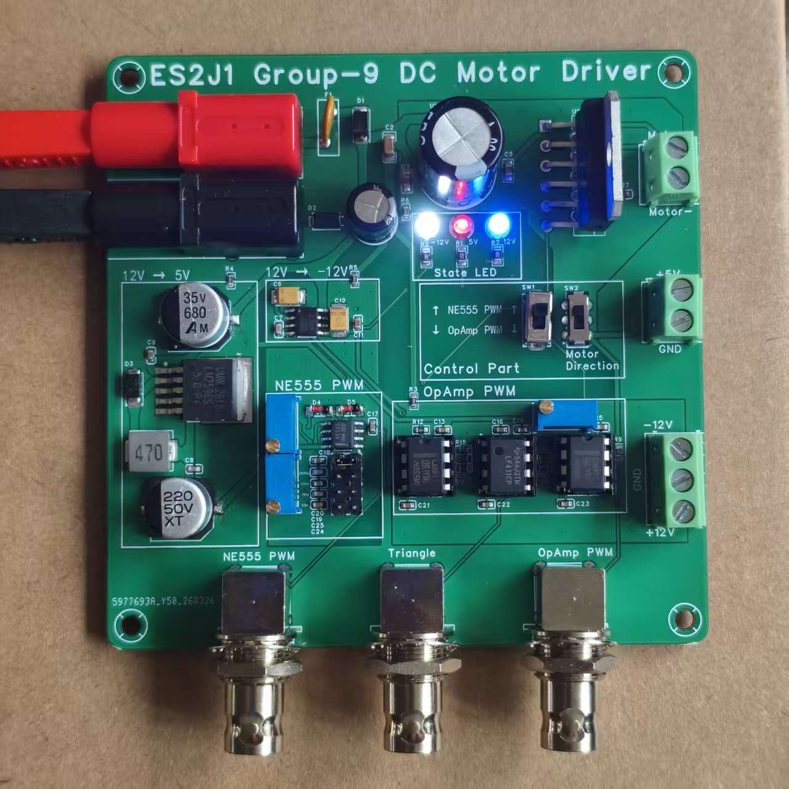

# 12V DC Motor Driver Board (PWM)

> **University of Warwick · School of Engineering · ES2J1 Electrical and Electronic Design Project · 2025–2026**

A fully analogue, hardware-based educational PCB demonstrator for teaching PWM generation, DC/DC power conversion, and bidirectional DC motor control. No microcontroller or Arduino is used — all control is implemented in discrete analogue hardware.

---

## 📸 PCB Photos




---

## 🎯 Project Overview

This board was designed as a laboratory teaching tool for second-year undergraduate electrical and electronic engineering students. It integrates five functional sub-systems on a single custom 2-layer PCB, allowing students to observe, measure, and compare real hardware behaviour against theoretical predictions.

**Key design constraints met:**
- Single **+12V** supply input only
- **No microcontroller** — fully analogue PWM generation
- Custom PCB designed in **Altium Designer** (no commercial kits)
- Total component cost: **£173.36** (within £200 budget)
- Complies with **IPC-A-610G** soldering standards and **BS EN 61010** safety requirements

---

## 🗂️ Repository Structure

```
ES2J1_Group9_Motor_Driver/
│
├── PCB/
│   ├── ES2J1_Group9_Motor_Driver.PrjPcb      # Altium Designer project file
│   ├── ES2J1_Group9_Schematic.SchDoc         # Full schematic capture
│   ├── ES2J1_Group9_PCB.PcbDoc               # PCB layout and routing
│
├── Images/
│   ├── PCB_V1.jpg                        # Assembled PCB photo (V1)
│   └── PCB_V2.jpg                        # Assembled PCB photo (V2)
│
├── videos/                               # Test and demonstration videos
│   ├── NE555 OCR.mp4
│   ├── OpAmp OCR.mp4
│   ├── Simulation & Circuit.mp4
│   └── Simulation with Osc.mp4
│
└── README.md
```

---

## ⚙️ System Architecture

The board accepts a single **+12V / GND** input and generates all other required voltages on-board. Five sub-systems work together to drive and control a DC motor:

```
+12V Input
    │
    ├──► DC/DC Buck Converter (LM2596S-5.0) ──► +5V rail (NE555 supply)
    │
    ├──► Charge Pump (ICL7660AIBAZA-T) ──────► −12V rail (Op-Amp supply)
    │
    ├──► NE555 PWM Generator ─────────────────────┐
    │                                             ├──► H-Bridge (L6203) ──► DC Motor
    └──► Op-Amp PWM Generator (LF411CP / LM311N) ─┘
              (selectable via SW1)
```

### Sub-system Summary

| Sub-system | Key Component | Function |
|---|---|---|
| DC/DC Buck Converter | LM2596S-5.0 (UMW) | +12V → +5V |
| Charge Pump | ICL7660AIBAZA-T (Renesas) | +12V → −12V |
| NE555 PWM Generator | NE555D (TI) + Potentiometer | Variable duty cycle PWM |
| Op-Amp PWM Generator | LF411CP + LM311N ×2 | Triangle wave + comparator PWM |
| H-Bridge Motor Driver | L6203 (STMicroelectronics) | Bidirectional motor control |
| Protection & Thermal Mgmt | MF-R110, SMAJ18CA, heatsink | Overcurrent & transient protection |

---

## 📐 Design Details

### DC/DC Buck Converter — LM2596S-5.0
- Switching frequency: **~150 kHz** (measured: 148 kHz)
- Output voltage: **+5.00V** (measured: +4.991V, error: 0.18%)
- Output ripple: **24 mV pk-pk** (spec: <50 mV)
- Efficiency ~80% — chosen over a linear regulator (7805) to minimise PCB heat dissipation

### Charge Pump — ICL7660AIBAZA-T
- Generates **−12V** from +12V with no inductors (capacitor-based inversion)
- Measured output: **−11.32V** (5.66% deviation due to downstream IC quiescent load)
- Supplies two LM311N comparators and one LF411CP op-amp

### NE555 PWM Generator
- Configured in **astable mode** with diode-modified charging paths for near-50% duty cycle
- Measured frequency: **846.6 Hz** at mid-potentiometer setting
- Theoretical: 910.8 Hz (7.05% error — attributable to component tolerances)
- Output amplitude: **4.95V pk-pk** (Vcc = 5V)

### Op-Amp PWM Generator — LF411CP / LM311N
- **LF411CP** integrator produces a triangular wave (frequency set by R14 × C18)
- **LM311N** comparator converts triangle wave against DC reference to PWM
- Duty cycle is **linearly proportional** to reference voltage — superior linearity vs NE555
- Measured PWM frequency: **71.90 kHz**, duty cycle: **50.14%** at mid-setting
- Both triangle wave and PWM brought out to **dedicated BNC connectors**

### H-Bridge Motor Driver — L6203
- Full-bridge topology supports **bidirectional** motor control
- Peak output current: **5A**
- Direction controlled by DPDT slide switch (SW2: MSS22D18G2) swapping IN1/IN2 logic
- Protection: LL4148 flyback diodes (D4, D5) + TVS diode (SMAJ18CA) on input rail

---

## 🧪 Test Results Summary

| Test           | Parameter           | Expected  | Measured    | Error |
| -------------- | ------------------- | --------- | ----------- | ----- |
| DC Rail — +5V  | Output voltage      | +5.00 V   | +4.991 V    | 0.18% |
| DC Rail — −12V | Output voltage      | −12.00 V  | −11.32 V    | 5.66% |
| Buck Converter | Switching frequency | 150 kHz   | 148 kHz     | 1.3%  |
| Buck Converter | Output ripple       | <50 mV    | 24 mV       | —     |
| NE555 PWM      | Frequency           | 910.8 Hz  | 846.6 Hz    | 7.05% |
| NE555 PWM      | Duty cycle (mid)    | ~50%      | 47.60%      | 4.8%  |
| Op-Amp PWM     | Duty cycle (mid)    | 50%       | 50.14%      | 0.28% |
| H-Bridge       | Motor direction     | Fwd / Rev | ✅ Confirmed | —     |

---

## 🛡️ Protection Features

| Protection | Component | Purpose |
|---|---|---|
| Overcurrent | MF-R110 resettable fuse | Disconnects circuit on excessive current |
| Transient overvoltage | SMAJ18CA TVS diode | Suppresses +12V rail voltage spikes |
| Inductive kickback | LL4148 signal diodes (D4, D5) | Protects H-bridge from motor back-EMF |
| Thermal management | Switching regulator + PCB trace sizing | Wide traces on high-current paths; component spacing |

---

## 🖥️ PCB Design

- **Tool:** Altium Designer (2-layer PCB)
- **Design rules:** Compact SW node for EMI reduction; decoupling caps within 1mm of IC pins; power traces ≥1mm for paths >500mA
- **BNC connectors** (U4, U5, U6) placed at board edge for direct oscilloscope access
- **Silkscreen labels** on all functional blocks for student usability
- Manufactured externally (Week 24); assembled and tested in supervised lab sessions (Weeks 30–31)
- All solder joints inspected to **IPC-A-610G** standard

---

## 💰 Bill of Materials Summary

| Category | Lines | Total Cost (£) |
|---|---|---|
| Capacitors | 28 | £59.61 |
| Resistors (incl. 3× potentiometers) | 17 | £8.70 |
| Active ICs | 6 | £36.24 |
| Diodes & Fuse | 6 | £29.42 |
| Connectors & Switches | 11 | £26.84 |
| Inductor, Bead, LEDs | 5 | £12.55 |
| **TOTAL** | **73** | **£173.36** |

> or

| Category               | Quantities | Total Cost (¥ RMB) |
| ---------------------- | ---------- | ------------------ |
| Capacitors             | 28         | ¥65.57             |
| Resistors              | 17         | ¥12.93             |
| Active ICs             | 6          | ¥84.28             |
| Diodes & Fuse          | 6          | ¥20.72             |
| Connectors & Switches  | 11         | ¥67.21             |
| Inductors, Bead & LEDs | 5          | ¥10.17             |
| **合计 TOTAL**           | **47**     | **¥260.98**        |

---

## 👥 Team

| Member | Key Contributions |
|---|---|
| **Boyu Zhang (Bob)**  | Team Leader · Project Manager · Buck Converter · Charge Pump · H-Bridge · Schematic · PCB Layout · Soldering · Testing |
| **Jiaye Yu**  | NE555 PWM Design · Soldering · Testing |
| **Adam Ward**  | Op-Amp PWM Circuit · Soldering |
| **Zhenyu Tang**  |  |
| **Arav Sharma**  | Protection & Thermal Management · Soldering |

**Project Director:** Dr Jose Ortiz Gonzalez, School of Engineering, University of Warwick

---

## 📚 Key References

1. Texas Instruments, *LM2596 SIMPLE SWITCHER® Power Converter*, SNVS124G, Mar. 2023.
2. Renesas Electronics, *ICL7660S, ICL7660A*, FN3179, Rev 7.01, Feb. 2020.
3. STMicroelectronics, *L6203 DMOS Full-Bridge Driver*, 2003.
4. Texas Instruments, *LF411 Low Offset, Low Drift JFET Input Op-Amp*, 2015.
5. Texas Instruments, *LM311 Voltage Comparator*, 2015.
6. Texas Instruments, *xx555 Precision Timers*, SLFS022K, Mar. 2026.
7. IPC, *IPC-A-610G: Acceptability of Electronic Assemblies*, 2017.
8. BSI, *BS EN 61010-1:2010: Safety Requirements for Electrical Equipment*, 2010.

---

## 📄 License

This project was developed for educational purposes as part of the ES2J1 module at the University of Warwick. All design files are shared for reference and learning.